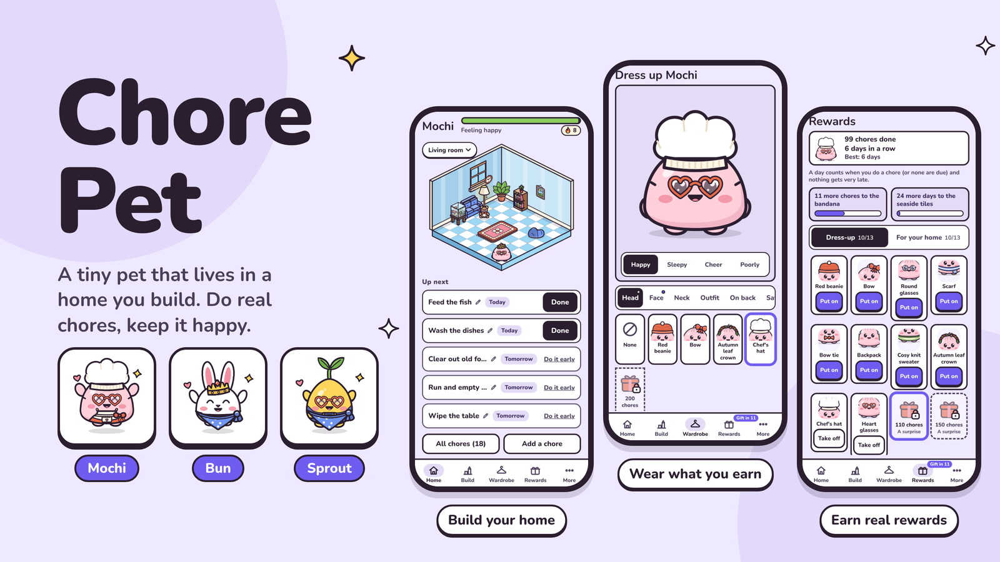

# Chore Pet: Hackyard Yard #4 write-up

**Theme:** Gamification. **Rule:** the real task has to get done.

- **Live link:** https://robertg761.github.io/chore-pet/
- **Repo:** https://github.com/Robertg761/chore-pet
- **Demo video (16:9):** https://robertg761.github.io/chore-pet/chore-pet-demo.mp4 (63 s, 1920 x 1080, 60 fps, with sound). A portrait cut for phones: https://robertg761.github.io/chore-pet/chore-pet-demo-portrait.mp4 (63 s, 1080 x 1920).
  - It tells one small story about Mochi with the real app: a stinky kitchen, a placed toilet bringing "Clean the toilet", Done and a cheer, a red beanie, the mess creeping back, catching up, and a cosy home weeks later.
  - It is recorded in the app with `npm run demo:story` (`FORMAT=landscape` for 16:9). The first, faster feature tour is still `npm run demo:record`.

## Listing

What goes on the hackyard.tech build card. The card shows the description in full, and the share card uses its first sentence.

- **Cover (16:9):** `docs/media/chore-pet-showcase.png` (1600 x 900), drawn by the app's own components with `npm run cover`
- **Demo:** the 16:9 video above
- **Description:**

  > Chore Pet is a tiny pet that lives in a home you build, and the only way to keep it happy is to do your real chores. Place a sink, a bed, a plant: each brings its own chores. Leave one late and it shows as mess; do it, tap Done, and the room sparkles, your pet cheers and gifts unlock: outfits, decor, new rooms. Not needed today? Skip it honestly, for nothing. No guilt, and the pet never dies. Try a sample home in one tap: no sign-up, works offline.

## What it is

Chore Pet is a tiny pet that lives in a home you build to look like yours.

- **Your home sets up your chores.** Place a sink and you get "Wash the dishes". Place a bed and you get "Make the bed". You never fill in a form: the building is the setup. Add a bathroom, a bedroom or a living room, each with its own furniture, walls and floor.
- **Late chores show as mess.** Mess appears on the object itself, so you can tell what's late just by looking at the room, and it gets worse at a pace that fits the chore: dishes get stinky within a couple of days, a weekly toilet after a few, a monthly oven clean over a fortnight. Stink clouds, flies, dust and dry leaves float over the worst offenders. The pet wanders over to the worst spot and says something kind about it.
- **The pet feels it.** Health drops with each late chore, and its mood goes from happy to content, meh and scruffy, down to sick in bed. It never dies, and catching up always brings it back.
- **Rewards only come from real chores.** Your first chore earns a gift on the spot. After that, chore milestones and streaks unlock 26 rewards in two tiers, from the first week to 200 chores and month-long streaks: outfits, hats, glasses, decor, wall colours and floors, ending in a chef's hat, an apron and a golden crown. Every reward is purely cosmetic, so nothing you earn brings new chores. Your streak sits beside the health bar, and vacation mode pauses everything, so a holiday never costs you a streak.

## Why the real task gets done

The game loop is the chore loop:
- You tap **Done** after doing the chore in real life.
- The object sparkles clean, the health bar ticks up and the pet cheers.
- Nothing in the game can be earned any other way: no currency, no ads, no grinding.

The pet is a reason to come back, not a guilt trip. It never dies, and its lines stay kind ("When you have a moment: wash the dishes").

## Try it in 30 seconds

1. Open the link and tap **Try a sample home**. You get a furnished kitchen with two late chores: the sink and the bin are messy.
2. Tap **Done** on "Wash the dishes". The sink sparkles clean and you unwrap your first gift, a red beanie.
3. Tap **Build my home** to start your own: pick Mochi, Bun or Sprout, name them, and build a room.

## What's in it

- **Three pets, every item fits every pet:**
  - Mochi the dumpling, Bun the bunny and Sprout the seedling.
  - Each has five moods, plus sleeping and cheering poses.
  - There are 4 eye styles and 4 cheek styles, and ten soft body colours.
  - A wardrobe holds 16 items across head, face, neck, outfit and back, plus saved outfits.
- **The rooms:**
  - Up to six rooms (kitchen, bathroom, bedroom, living room), each a roomy 8x8 isometric room with drag-and-snap building and rotation.
  - A pill over the room names the one on show and counts what's late in the others; its sheet switches, adds and removes rooms.
  - Footprint checks: things can't overlap, and posters can't cover the window.
  - 17 objects that bring chores, all available from the start (a sample kitchen shows a fitted counter run, the sink under the window and a dining table), and 7 chore-free decor pieces to unlock.
  - Every chore object is drawn clean, a little messy and very messy.
- **Schedules:**
  - Daily, every N days, chosen weekdays, weekly and monthly.
  - Every chore has a pencil to edit it. A Chores screen groups them by object, removes several at once and adds removed ones back.
  - **Skip this time:** when a round isn't needed (no laundry this week, you ate out), skip it instead of tapping Done for something you didn't do. Nothing goes messy, but a skip earns nothing, so the honest tap is never the costly one.
  - A week view shows the last seven days.
  - Moving house? Start over clears the room and chores but keeps the pet, its look and every reward.
- **Progress is never lost:**
  - It works offline first, from IndexedDB, and syncs to Supabase.
  - Everyone starts as a guest with no sign-up.
  - In Settings, a guest saves their home to email or Google. That links the same account, so nothing moves, and the home then opens on any device.
- **Motion:** screens slide in from where they live, finished chores fold away, sheets spring up and can be dragged down, and the pet breathes and blinks. Players who ask for less motion get none.
- **One screen, phone or desktop:** every screen fits the window with no scrolling: tabs along the bottom on a phone, a side rail and two columns on a desktop browser.
- **Phone-first PWA:**
  - Installable and works offline.
  - An opt-in daily nudge in the pet's voice.
  - Soft synthesised sounds, made with the Web Audio API.
  - A shareable picture of your home.
- **Accessibility:**
  - axe reports no WCAG 2.1 AA issues on any screen.
  - Full keyboard use with visible focus; the pet is a real button with a spoken mood.
  - Reduced-motion support and 44 px touch targets.

All art is hand-drawn SVG written as code, from scratch: no asset packs, no images and no emoji in the UI.

## How it was built

All code was written fresh during the Yard, solo, with Claude Code:
- **One lead agent** owned the architecture and domain rules, plus anything where consistency mattered: the isometric engine, sync, health and streak rules, the character system, and review.
- **Project subagents** took self-contained tasks in parallel batches:
  - an SVG artist for the pets, objects, outfits and effects;
  - a UI builder for the screens;
  - a catalog curator for content and pet lines;
  - a test writer.
- **Review:** each result was checked against the art contract (`docs/ART.md`) in a live gallery (`/?art`) and by tests before it landed.
- **Plan:** `docs/PLAN.md` holds the phase-by-phase plan and who did what.
- **Tests:** 1,497 unit tests cover schedules, skips, health, mess, streaks, unlocks, rewards, rooms, sync, tile maths and placement, and 38 browser tests drive the production build. The last features were tested and reviewed by parallel Haiku subagents before the lead checked them.

## Honest limits

- **Reminders:** nudges arrive only while the app is open or in the background, because there is no push server. On iPhone they need the app added to the home screen first, and the app explains this.
- **Testing:** final QA ran in phone emulation (390 px, touch, offline reload), not on a physical phone.
- **Photo proof:** proving a chore with a photo is on hold. The schema keeps a flag for it.
