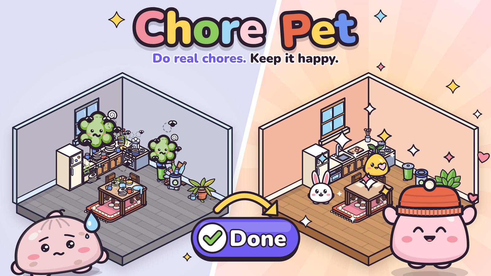

# Hackyard Yard #4 submission: Chore Pet

Everything needed to submit Chore Pet on [hackyard.tech](https://hackyard.tech/yards/yard-4) is in this folder.

- **Deadline:** Friday 9 October, 18:00 UTC. Voting closes Sunday 11 October, 22:00 UTC.
- **Who can submit:** only Robert, from his own hackyard.tech account.

## Checklist

1. **Title:** `Chore Pet`
2. **Tagline**, if the form asks for one line: `A tiny pet that lives in a home you build. Do real chores, keep it happy.`
3. **Description:** paste the whole of [`description.txt`](description.txt) (91 words). Its first sentence is what the share card shows.
4. **Cover image:** upload [`cover-1600x900.png`](cover-1600x900.png) (16:9, 1600 x 900).
5. **Demo video:** paste the link https://robertg761.github.io/chore-pet/chore-pet-demo.mp4 (16:9, 63 s, with sound).
   - If the form needs a file upload instead, open that link on a computer and save it, or take it from [`docs/media/chore-pet-demo.mp4`](../docs/media/chore-pet-demo.mp4) in the repo.
   - A portrait cut, for anywhere that wants phone-shaped video: https://robertg761.github.io/chore-pet/chore-pet-demo-portrait.mp4
6. **Live link:** https://robertg761.github.io/chore-pet/
7. **Source code:** https://github.com/Robertg761/chore-pet (MIT licensed, see [`LICENSE`](../LICENSE))
8. **Theme:** Gamification.
9. **Before you press submit:** open the live link once and tap **Try a sample home**, so you know what judges will see first.

## Copy for any other fields

**One sentence**
> Chore Pet is a tiny pet that lives in a home you build, and the only way to keep it happy is to do your real chores.

**How it fits the theme (Gamification)**
> The game loop is the chore loop. Every object you place brings a real chore. Leave it late and it shows as mess on that object, and your pet feels it. Do it in real life, tap Done, and the room sparkles, the pet cheers and gifts unlock. Nothing can be earned any other way: no shop, no coins, no grinding. Skipping a chore honestly earns nothing, so the honest tap is never the costly one. The pet never dies and never guilt-trips.

**What judges should try (30 seconds)**
> Tap "Try a sample home". Tap Done on "Wash the dishes": the sink sparkles and you unwrap your first gift. Then tap "Build my home" to start your own: pick Mochi, Bun or Sprout and place a few things.

**How it was built**
> All code was written fresh during the Yard, solo, with Claude Code. One lead agent owned the architecture, domain rules and review. Project subagents (an SVG artist, a UI builder, a catalog curator and a test writer) took tasks in parallel. All art is hand-drawn SVG written as code: no asset packs, no images, no emoji. It is a React and TypeScript PWA that works offline first and syncs to Supabase. 1,497 unit tests and 38 browser tests cover it.

**Built with**
> React, TypeScript, Vite, a PWA with offline storage, Supabase, hand-authored SVG, Vitest, Playwright, Claude Code.

## Files in this folder

| File | What it is |
|---|---|
| `README.md` | This checklist |
| `description.txt` | The 91-word description, ready to paste |
| `cover-1600x900.png` | The cover image (16:9) |
| `share-card-1200x630.png` | The social share card. The live site already uses it as its link preview, so only upload it if the form asks for a second image. |

The images here are copies of the published ones in `docs/media/`. If the cover is redrawn (`npm run build && npm run cover`), copy the new files here again.

## More detail

The full write-up, with features, how it was made and honest limits, is in [`docs/SUBMISSION.md`](../docs/SUBMISSION.md).
